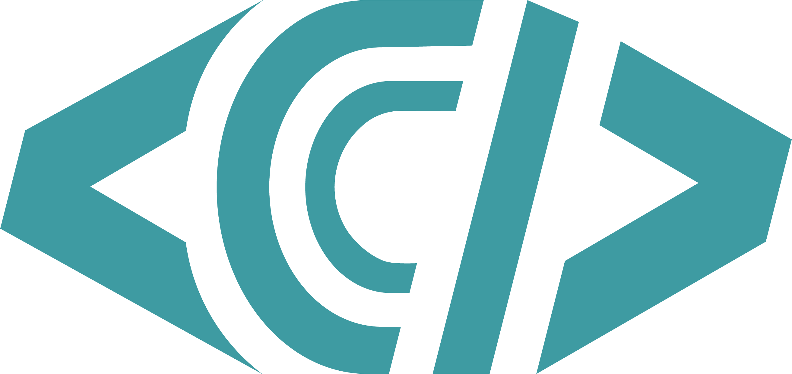

# Newman Coding Club

<div align="center">
  
  <h3>Learn. Build. Connect.</h3>
  <p>Breaking barriers and building skills through code at Newman University Wichita</p>
</div>

## About the Club

The Newman Coding Club is a student-led organization at Newman University Wichita dedicated to fostering interest in computer programming and software development. Our mission is to create a supportive community where students of all majors and experience levels can learn to code, collaborate on projects, and connect with professional opportunities in tech.

### Our Purpose

- Foster interest in computer programming and software development among Newman University students
- Provide a supportive community for students to learn and practice coding skills
- Share knowledge and resources related to programming and technology
- Create opportunities for practical application of programming skills through projects and activities
- Connect members with professional development and career opportunities in technology fields
- Make coding accessible and enjoyable for students of all experience levels

## Getting Started

### Prerequisites

- No prior coding experience required—just bring your curiosity and willingness to learn!
- A laptop (if you have one; we can help if you don't)
- Current enrollment at Newman University

### Joining the Club

1. Attend any of our meetings or events (check the [Events](#upcoming-events) section)
2. Fill out a membership form at one of our meetings or on our website
3. Join our Discord community for announcements and discussions

## Membership Requirements

To maintain active membership status:
- Attend at least three (3) meetings per semester
- Participate in at least one (1) club activity per semester
- Conduct yourself in accordance with the Club's values and Newman University's code of conduct

## Club Activities

We organize various activities throughout the academic year:

- **Regular Workshops**: Hands-on coding sessions covering different languages and technologies
- **Project Work Sessions**: Collaborative time to work on semester projects
- **Guest Speaker Events**: Learn from professionals in the tech industry
- **Hackathons**: Time-limited coding competitions to build projects
- **Industry Tours**: Visit local tech companies and see programming in action
- **Community Outreach**: Share coding knowledge with the broader community

## Leadership Team

Our Executive Board for the 2024-2025 academic year:

- **President**: Kelly Lotsu-Morgan
- **Vice President**: Thatcher McClure
- **Secretary**: Ariana Sweitzer
- **Treasurer**: David Machaud
- **Events Coordinator**: Gabe Gorcos

## Faculty Advisor

- **Dr. Robert Norman**
- **Dr. David Cochran**

## Technology Focus

The club works with a variety of programming languages and technologies, including:

- HTML/CSS for web development
- JavaScript and web frameworks
- Python for general programming
- Node.js for backend development
- Mobile app development
- Data science and machine learning concepts
- Version control with Git

## Get In Touch

- **Email**: newmancodingclub@gmail.com
- **GitHub**: [https://github.com/newmancodingclub](https://github.com/newmancodingclub)
- **Discord**: Join our server (link available upon request)
- **Instagram**: [@newmancodingclub](https://www.instagram.com/newmancodingclub)

## Developer Guide

This section provides technical information for future maintainers of the Newman Coding Club website.

### Technology Stack

This website is built with:
- [Next.js 14](https://nextjs.org/) - React framework
- [TypeScript](https://www.typescriptlang.org/) - Type-safe JavaScript
- [Tailwind CSS](https://tailwindcss.com/) - Utility-first CSS framework
- [Framer Motion](https://www.framer.com/motion/) - Animation library
- [React Icons](https://react-icons.github.io/react-icons/) - Icon library
- [Headless UI](https://headlessui.com/) - Unstyled UI components

### Getting Started with Development

#### Prerequisites

- [Node.js](https://nodejs.org/) (v18.0.0 or newer)
- [npm](https://www.npmjs.com/) (v8.0.0 or newer) or [yarn](https://yarnpkg.com/) (v1.22.0 or newer)
- [Git](https://git-scm.com/)

#### Setting Up the Development Environment

1. Clone the repository:
   ```bash
   git clone https://github.com/newman-coding-club/website.git
   cd website
   ```

2. Install dependencies:
   ```bash
   npm install
   # or
   yarn install
   ```

3. Start the development server:
   ```bash
   npm run dev
   # or
   yarn dev
   ```

4. Open [http://localhost:3000](http://localhost:3000) with your browser to see the result.

### Project Structure

```
src/
├── app/               # Next.js app router files
│   ├── globals.css    # Global CSS
│   ├── layout.tsx     # Root layout
│   └── page.tsx       # Home page
├── components/        # Reusable UI components
│   ├── Benefits/      # Benefits section components
│   ├── Events/        # Events section components
│   └── ...            # Other components
├── data/              # Data files for content
│   ├── benefits.tsx   # Benefits section content
│   ├── events.ts      # Events content
│   └── ...            # Other data files
├── types.ts           # TypeScript type definitions
└── utils.tsx          # Utility functions
```

### Making Changes

#### Content Updates

Most content can be updated by modifying the files in the `src/data/` directory. For example:

- To update events, modify `src/data/events.ts`
- To update leadership info, modify `src/data/leadership.ts`
- To update FAQs, modify `src/data/faq.ts`

#### Adding New Features

1. Create any necessary components in the `src/components/` directory
2. Update or create data files in the `src/data/` directory
3. Modify `src/app/page.tsx` to include your new components
4. Add any necessary types to `src/types.ts`

### Contribution Workflow

#### 1. Create a Branch

Always create a new branch for your changes:

```bash
git checkout -b feature/your-feature-name
```

Use a descriptive branch name that reflects the changes you're making.

#### 2. Make Your Changes

Make your code changes following the project's code style and structure.

#### 3. Test Your Changes

Before committing, ensure your changes work as expected:

```bash
npm run build
npm run start
```

#### 4. Commit Your Changes

Make descriptive commits with clear messages:

```bash
git add .
git commit -m "Add feature: description of what you did"
```

#### 5. Push Your Branch

```bash
git push origin feature/your-feature-name
```

#### 6. Create a Pull Request

1. Go to the [repository on GitHub](https://github.com/newman-coding-club/website)
2. Click "Pull requests" and then "New pull request"
3. Select your branch as the compare branch
4. Add a title and description explaining your changes
5. Request a review from another club member
6. Click "Create pull request"

### Deployment

The website is deployed on [Vercel](https://vercel.com/). The deployment process is:

1. Automatic deployments are triggered when changes are pushed to the `main` branch
2. Pull request previews are generated automatically
3. To manually deploy, commit and push to the `main` branch:
   ```bash
   git checkout main
   git merge feature/your-feature-name
   git push origin main
   ```

### Environment Variables

If you need to add environment variables:

1. Create a `.env.local` file in the root directory
2. Add your variables in the format `KEY=value`
3. Reference them in your code as `process.env.KEY`
4. For production, add these variables in the Vercel project settings

### Troubleshooting

- **Build errors**: Try `npm run clean` followed by `npm install` and `npm run build`
- **Type errors**: Make sure all required types are defined in `src/types.ts`
- **Styling issues**: Check Tailwind classes and consult the Tailwind CSS documentation

### Resources

- [Next.js Documentation](https://nextjs.org/docs)
- [Tailwind CSS Documentation](https://tailwindcss.com/docs)
- [TypeScript Documentation](https://www.typescriptlang.org/docs/)
- [Vercel Documentation](https://vercel.com/docs)

## License

This project is open source and available under the [MIT License](LICENSE).

## Acknowledgments

Special thanks to Newman University for supporting our club activities, and to all the members who make this community possible!
