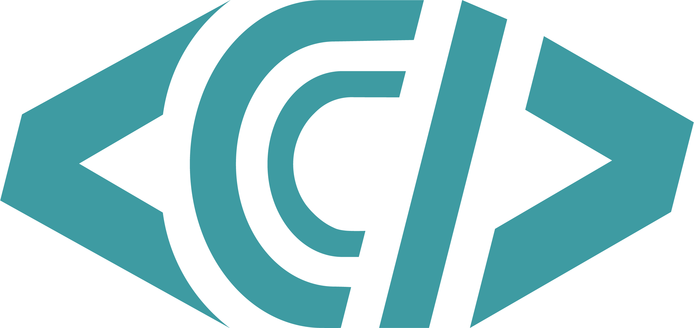

# Newman Coding Club

  
  <h3>Learn. Build. Connect.</h3>
  
Breaking barriers and building skills through code at Newman University Wichita

## About the Club

The Newman Coding Club is a student-led organization at Newman University Wichita dedicated to fostering interest in computer programming and software development. Our mission is to create a supportive community where students of all majors and experience levels can learn to code, collaborate on projects, and connect with professional opportunities in tech.

### Our Purpose

- Foster interest in computer programming and software development among Newman University students
- Provide a supportive community for students to learn and practice coding skills
- Share knowledge and resources related to programming and technology
- Create opportunities for practical application of programming skills through projects and activities
- Connect members with professional development and career opportunities in technology fields
- Make coding accessible and enjoyable for students of all experience levels

## Getting Started

### Prerequisites

- No prior coding experience required—just bring your curiosity and willingness to learn!
- A laptop (if you have one; we can help if you don't)
- Current enrollment at Newman University

### Joining the Club

1. Attend any of our meetings or events (check the [Events](#upcoming-events) section)
2. Fill out a membership form at one of our meetings or on our website
3. Join our Discord community for announcements and discussions

## Membership Requirements

To maintain active membership status:
- Attend at least three (3) meetings per semester
- Participate in at least one (1) club activity per semester
- Conduct yourself in accordance with the Club's values and Newman University's code of conduct

## Club Activities

We organize various activities throughout the academic year:

- **Regular Workshops**: Hands-on coding sessions covering different languages and technologies
- **Project Work Sessions**: Collaborative time to work on semester projects
- **Guest Speaker Events**: Learn from professionals in the tech industry
- **Hackathons**: Time-limited coding competitions to build projects
- **Industry Tours**: Visit local tech companies and see programming in action
- **Community Outreach**: Share coding knowledge with the broader community

## Leadership Team

Our Executive Board for the 2024-2025 academic year:

- **President**: Kelly Lotsu-Morgan
- **Vice President**: Vince Wong
- **Secretary**: Ariana Sweitzer
- **Treasurer**: Neil Scarberry
- **Events Coordinator**: Thatcher McClure

## Faculty Advisor

- **Dr. Robert Norman**

## Technology Focus

The club works with a variety of programming languages and technologies, including:

- HTML/CSS for web development
- JavaScript and web frameworks
- Python for general programming
- Node.js for backend development
- Mobile app development
- Data science and machine learning concepts
- Version control with Git

## Get In Touch

- **Email**: coding.club@newmanu.edu
- **GitHub**: [https://github.com/newman-coding-club](https://github.com/newman-coding-club)
- **Discord**: Join our server (link available upon request)
- **Instagram**: [@newmancodingclub](https://www.instagram.com/newmancodingclub)

## License

This project is open source and available under the [MIT License](LICENSE).

## Acknowledgments

Special thanks to Newman University for supporting our club activities, and to all the members who make this community possible!